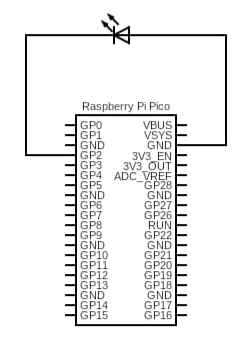
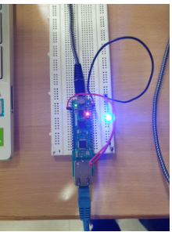

<html>
  
  <body>
<h1>Tools used</h1>
    <ul>
      <li>IDE: Arduino IDE</li>
       <li>Board used: Raspberry pi Pico board</li>
      <li>Protocol: MQTT</li>
    </ul>
<h1>WORKING OF PROJECT</h1>
<h3>Facemask detection using open-cv </h3>

There are two main steps.
-Identify human Face and Mouth in each frame of input video
-Identify Person is using Mask or not
The video is analyzed for facemask and the data after detecting whether the mask is on or off is generated.

<h3>Ethernet connection to MQTT </h3>

The ethernet connection to the pico board is established using ethernet libraries. Establish an MQTT connection to publish the data obtained from the face detection file i.e facedetection.py  using ethernet. After connection establishment, send the data as a message.

<h3>LED blinking using pico board </h3>

The data subscribed from the MQTT server is fetched to the pico board and the code in the pico board turns on/off the LED bulb based on whether the person is wearing the mask or not.

    <h1>Screenshots</h1>
</body>
</html>

